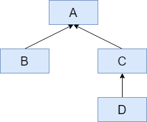
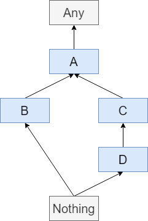
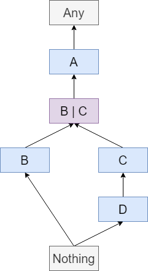
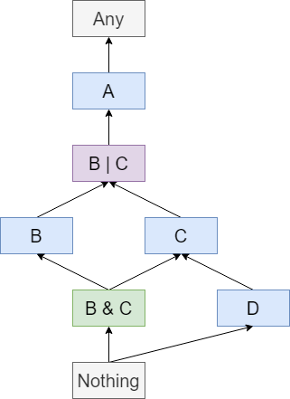

# Subtyping-Checker
Rules for checking a simple subtyping system.

This is a little toy project I made to learn a bit of Prolog.
It describes a simple type system and can answer queries about the subtyping relationship between two types:
```pl
?- subtype(c, a).
true .

?- subtype(d, c).
true .

?- subtype(d, a).
true .

?- subtype(intersection(b, c), a).
true .

?- subtype(d, union(b, c)).
true .
```
And more!

## Features
### ✔️ Simple named types
Types can be introduced by stating which type is its direct super type.
```pl
extends(b, a).
extends(c, a).
extends(d, c).
```
These declarations correspond to the following type lattice when ordered under subtyping:



### ✔️ Top and Bottom Type
The type system has a universal top type, `Any`, and a universal bottom type `Nothing`. The former is the supertype of all types, and the latter is the subtype of all types.

That is, `subtype(X, any).` and `subtype(nothing, X).` would each enumerate all (infinitely-many) types.

With that in mind, the above diagram can be more-correctly shown as:



### ✔️ Type Unions
A value of the type `A | B` must be of type `A` *or* `B`. Each of the members of a union are subtypes of the union.

These are expressed as `union(a, b)`. This can be nested to produce an arbitrarily-large union: `union(a, union(b, union(c, ...)))`.

Because there are infinitely-many unions of any number of types, I'll only add one interesting one to the diagram:



### ✔️ Type Intersections
A value of the type `A & B` must be of type `A` *and* `B`. The intersection is a subtype of each member of the union.

These are expressed as `intersection(a, b)` and can be nested like unions.

Again, adding just one intersection...



### ❌ Higher Kinded Types
Eventually, I would like to support higher kinded types, with all sorts of variance. For now, this is not supported.